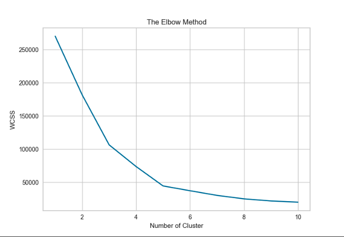
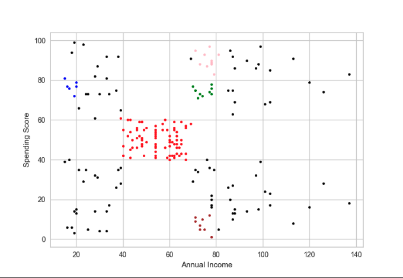
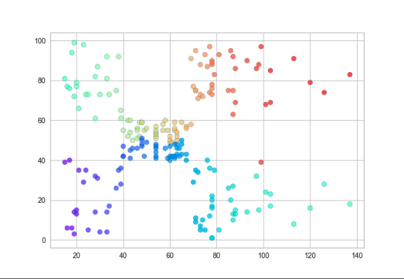

# Welcome to my Machine Learning Research Project 

## I Conducted This During Independent Research At the University of the Virgin Islands

(Please note all credit for the data collected goes to the following GitHub repo https://gist.github.com/pravalliyaram/5c05f43d2351249927b8a3f3cc3e5ecf), This research is for educational purposes only.

Within this Repo I have attached a PowerPoint presentation as well as The Research Report. I have also included the results of the code provided.

Here is the charts that are displayed as an outcome:

# K-Means:

# DBSCAN

# BIRCH
